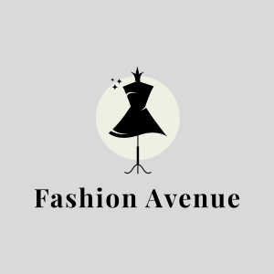
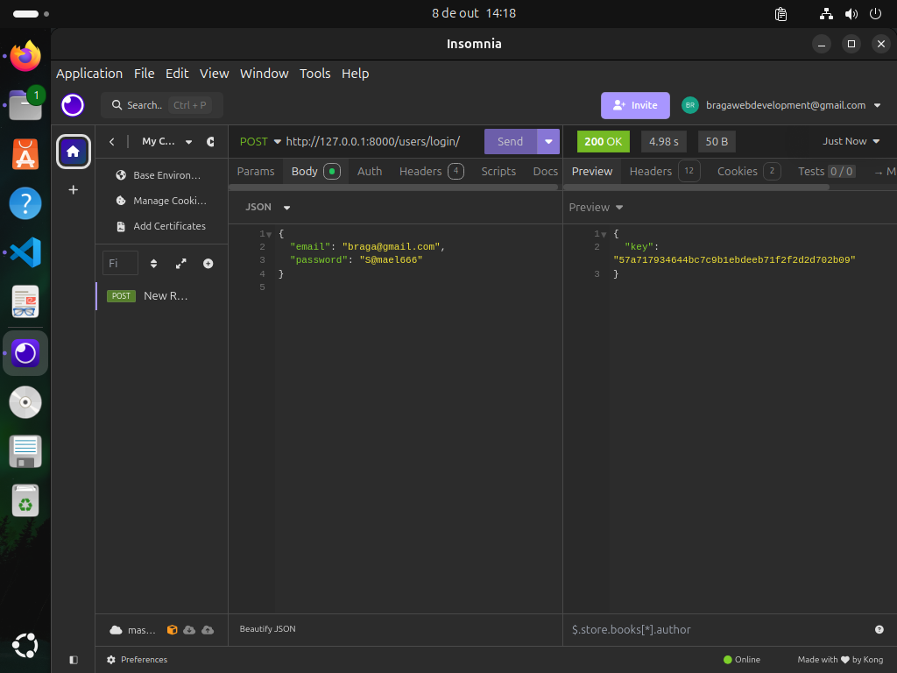
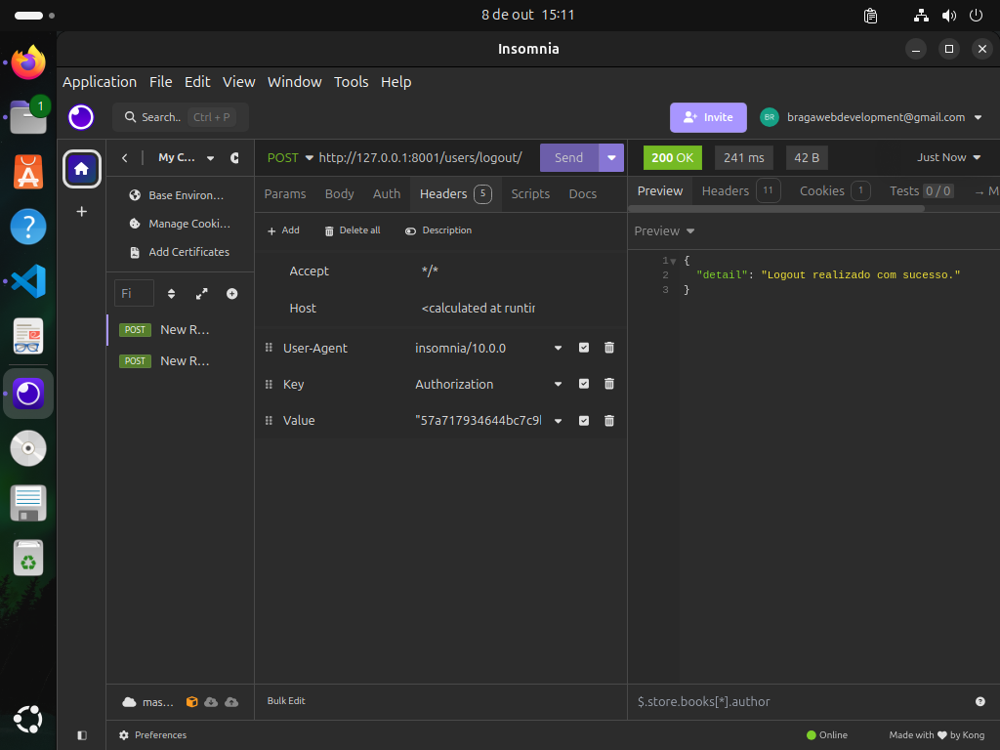
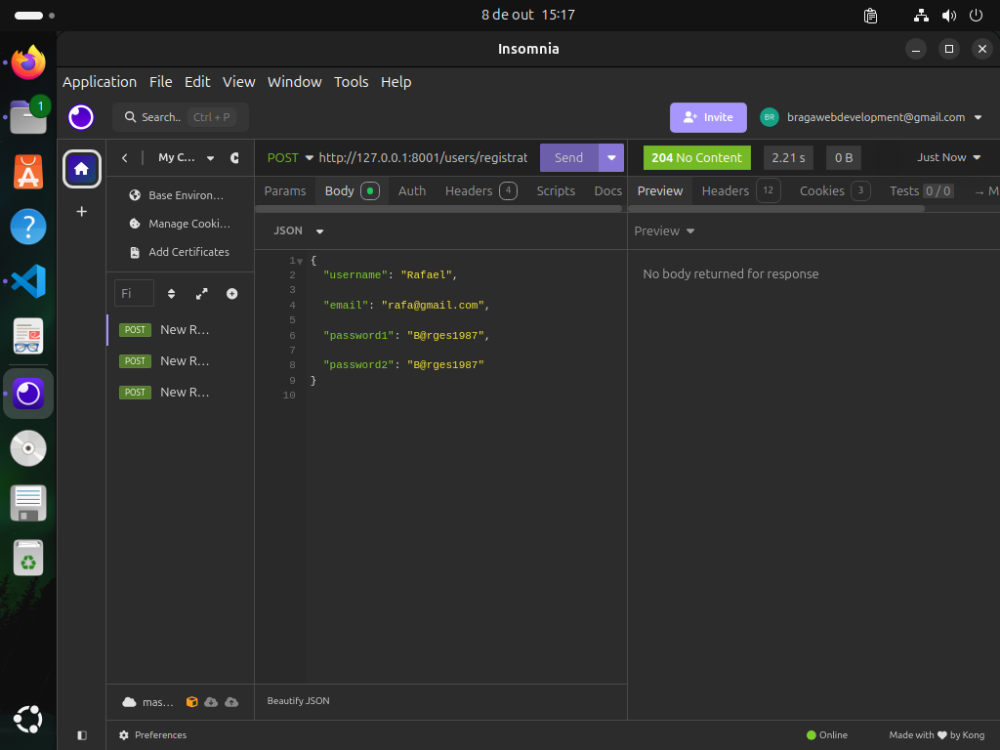

<div align="center">
    
</div>


<div style="text-align: justify;">
    <h4> 
        Fashion Avenue (Avenida da Moda) é um e-commerce inovador e dedicado ao segmento de moda e vestuário, projetado para atender às necessidades de todos os estilos e gostos. Aqui, você pode explorar uma ampla variedade de roupas, desde peças casuais e elegantes até opções mais sofisticadas para ocasiões especiais. Nosso catálogo diversificado é cuidadosamente organizado em categorias, cores, preços e tamanhos, tornando a sua experiência de compra ainda mais fácil e agradável. Seja você um amante da moda ou alguém em busca de um visual prático para o dia a dia, na Fashion Avenue você encontrará tudo o que precisa. Além disso, estamos comprometidos em oferecer as últimas tendências do mercado, com novas coleções sendo adicionadas regularmente. Nosso objetivo é proporcionar uma experiência de compra única, onde qualidade e estilo se encontram, garantindo que você se sinta confiante e estiloso em todas as ocasiões.
    </h4>
</div>

<h4> 
    Equipe:
    Edivan Figueiredo Braga
</h4>


<h2 align="center"> 
    :construction:  Projeto em construção  :construction:
</h2>

### Pré-requisitos

Antes de começar, você vai precisar ter instalado em sua máquina Python 3.10 ou qualquer versão acima. Além disso, é bom ter um editor para trabalhar com o código, como [VSCode](https://code.visualstudio.com/).

### 🎲 Rodando o Back End (servidor)

```bash
# Clone este repositório
$ git clone https://github.com/CaosFera/FASHION-AVENUE.git

# 1. Acesse a pasta do projeto
$ cd Fashion-Avenue

# 2. Crie e ative o ambiente virtual (virtualenv)
$ python -m venv venv
$ source venv/bin/activate  # Linux e Mac
$ venv\Scripts\Activate  # Windows

# 3. Instale as dependências do projeto
$ pip install -r requirements.txt

# 4. Execute as migrações do banco de dados
$ python manage.py migrate

# 5. Crie um superusuário para acessar o admin do Django
$ python manage.py createsuperuser

# 6. Execute o servidor em modo de desenvolvimento
$ python manage.py runserver

# O servidor inciará na porta:8000 - acesse <http://localhost:8000>
🎯 Aqui estão as principais rotas da API de e-commerce:

🔑 Autenticação de Usuários:

    POST /users/login/ Dar acesso ao usuário
    POST /users/logout/ Desconecta o usuário
    POST /users/registration/ Resgistra um usuário
    
    
    


🛒 Produtos:

    GET /products/ - Retorna a lista de produtos disponíveis.
    GET /categories/slug/{id}/products/slug/{id}/ - Retorna os detalhes de um produto específico.
    POST /categories/slug/{id}/products/slug/{id}/ - Cria um novo produto (requer autenticação de administrador).
    PUT /categories/slug/{id}/products/slug/{id}/ - Atualiza um produto (requer autenticação de administrador).
    DELETE /categories/slug/{id}/products/slug/{id}/ - Exclui um produto (requer autenticação de administrador).

    
📦 Categorias:

    GET /categories/ - Retorna a lista de categorias de produtos.
    GET /categories/slug/{id}/ - Retorna os detalhes de uma categoria específica.
    POST /categories/slug/{id}/ - Cria uma nova categoria (requer autenticação de administrador).
    PUT /categories/slug/{id}/ - Atualiza uma categoria (requer autenticação de administrador).
    DELETE /categories/slug/{id}/ - Exclui  uma categoria (requer autenticação de administrador).

🛍️ Carrinho de Compras:

    GET /cart-detail/ - Retorna os itens no carrinho de compras do usuário.
    POST /cart/ - Adiciona um produto ao carrinho.
    DELETE /cart/ - Remove um produto do carrinho.


🛠️ Tecnologias Utilizadas

As principais tecnologias usadas no desenvolvimento deste projeto incluem:

    Backend: Django, Django Rest Framework.
    Banco de Dados: PostgreSQL.
    Bibliotecas:
    * pillow para gerenciamento de imagens dos produtos;
    * dj_rest_auth e django-allauth para autenticação de usuários;
    * django-filter para criar filtros.


